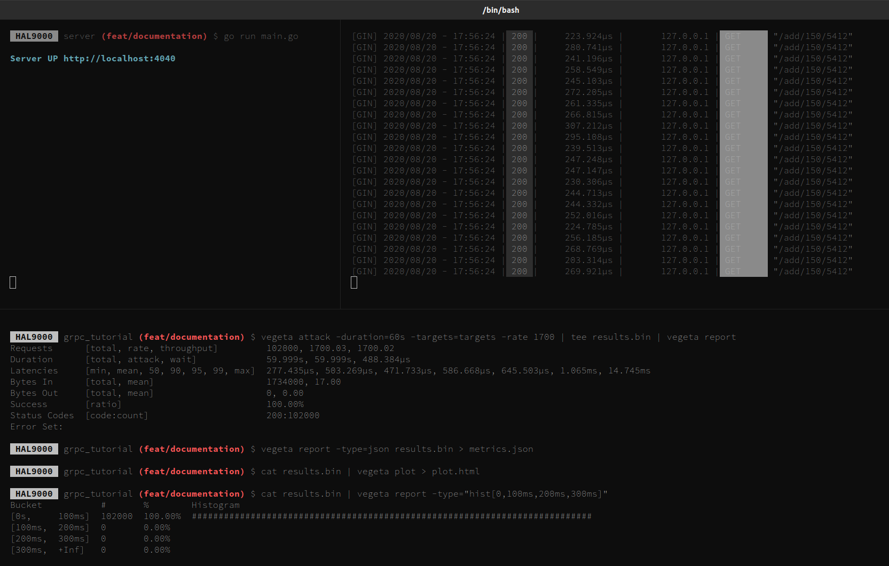
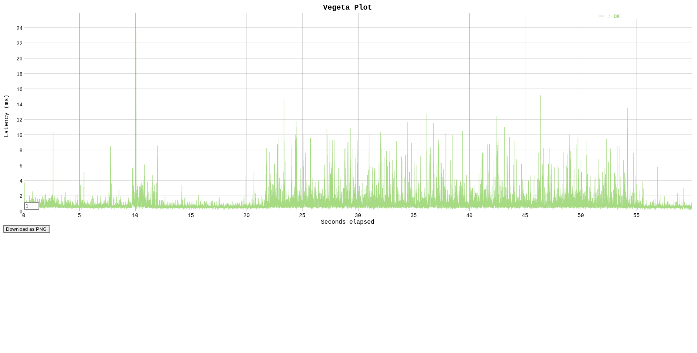

# An Basic API with gRPC and Protobuf

##  Build a basic API using gRPC and protobufs in Go
An hello-world example of the basic API using [gRPC](https://grpc.io/) and [protobuf](https://developers.google.com/protocol-buffers/) in [Go](https://golang.org/)

### USAGE
Run `go run main.go` into the server folder

Run `go run main.go` into the client folder

## See the beauty
Open [localhost/add/80/60](http://localhost:8080/add/80/60)

Open [localhost/mult/80/60](http://localhost:8080/add/80/60)

## Load Test with [VEGETA](https://github.com/tsenart/vegeta)

<!-- protoc --proto_path=proto --proto_path=/home/balbino/work/src/google.golang.org --go_out=plugins=grpc:proto service.proto -->